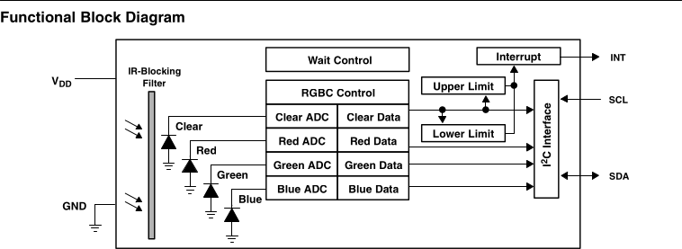
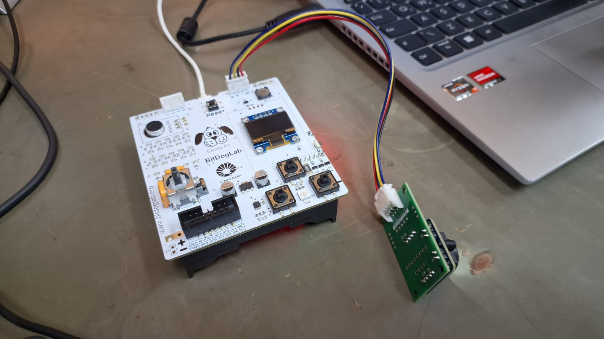
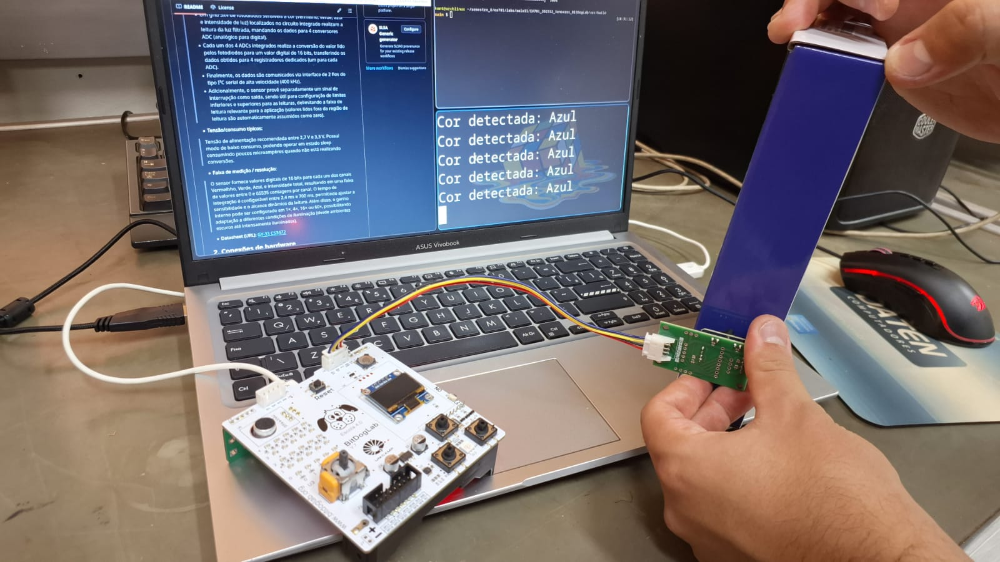
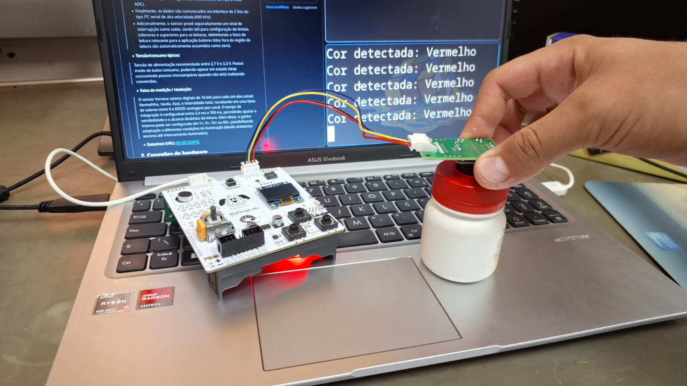

# Sensor de Cor GY-33 TCS34725 — Sensores na BitDogLab

**Dupla:** Tiago Silveira Zaparoli (237310 / TZShinobi), Vinicius P. M. Miguel (260731 / viniciuskant)
**Turma:** EA801 — 2025S2  

## 1. Descrição do sensor
- Fabricante / modelo: GY-33 TCS34725
- Princípio de funcionamento:



>  O sensor TCS3472 retorna uma saída digital correspondendo às leituras de luz vermelha, verde e azul, bem como a intensidade total da luz recebida pelo sensor. Para tanto o sensor segue o seguinte fluxo de operação:
>- A luz é percebida pelo sensor e passada por um filtro bloqueador de luz infravermelha (IR blocking filter), responsável por diminuir a contribuição da luz infravermelha no espectro de luz obtido e permitindo melhor precisão na leitura dos dados.
>- Um grid 3x4 de fotodiodos sensíveis à cor (vermelho, verde, azul e intensidade de luz) localizados no circuito integrado realizam a leitura da luz filtrada, mandando os dados para 4 conversores ADC (analógico para digital).
>- Cada um dos 4 ADCs integrados realiza a conversão do valor lido pelos fotodiodos para um valor digital de 16 bits, transferindo os dados obtidos para 4 registradores dedicados (um para cada ADC).
>- Finalmente, os dados são comunicados via interface de 2 fios do tipo I²C serial de alta velocidade (400 kHz).
>- Adicionalmente, o sensor provê separadamente um sinal de interrupção como saída, sendo útil para configuração de limites inferiores e superiores para as leituras, delimitando a faixa de leitura relevante para a aplicação (valores lidos fora da região de leitura são automaticamente assumidos como zero).

- Tensão/consumo típicos:
> Tensão de alimentação recomendada entre 2,7 V e 3,3 V. Possui modo de baixo consumo, podendo operar em estado sleep consumindo poucos microampères quando não está realizando conversões.

- Faixa de medição / resolução:
> O sensor fornece valores digitais de 16 bits para cada um dos canais Vermelhho, Verde, Azul, e intensidade total, resultando em uma faixa de valores entre 0 e 65535 contagens por canal. O tempo de integração é configurável entre 2,4 ms e 700 ms, permitindo ajustar a sensibilidade e o alcance dinâmico da leitura. Além disso, o ganho interno pode ser configurado em 1×, 4×, 16× ou 60×, possibilitando adaptação a diferentes condições de iluminação (desde ambientes escuros até intensamente iluminados).

- Datasheet (URL): [GY-33 CS3472](https://cdn-shop.adafruit.com/datasheets/TCS34725.pdf)

## 2. Conexões de hardware
- Para realizar a conexão utiliza-se a conexão J6, conforme a tabela:

| Pino GY-33 (TCS34725) | BitDogLab (RP2040) | Função                           |
| --------------------- | ------------------ | -------------------------------- |
| VIN                   | 3V3                | Alimentação                      |
| GND                   | GND                | Referência (Ground)              |
| SDA                   | GP0 (I2C0 SDA)     | Comunicação I2C                  |
| SCL                   | GP1 (I2C0 SCL)     | Comunicação I2C                  |

- O pino INT de interrupção não é utilizado na implementação.

## 3. Dependências
- picotool, versão: 2.2.0
- picocom, versão: 3.1

- Para instalar o picotool e o picocom:

    ```bash
    yay -S picotool picocom
    ```
    

## 4. Exemplos de uso
- Navegue até a pasta ```src``` e execute:
  ```bash
  mkdir build && cd build
  cmake ..
  make
  ```
- Execute o PicoTool, carregando o código ```main.uf2``` para a placa:
  ```bash
  picotool load main.uf2 -f
  ```
- Para ler a saída serial produzida, utilize o picocom pelo comando, substituindo pelo caminho para a placa:
  ```bash
  picocom /dev/ttyACM0
  ```

## 5. Resultados e validação
A seguir um exemplo de montagem e detecção das cores Azul e Vermelho:





- Dentre as limitações do projeto estão a detecção limitada de cores: detectando apenas Vermelho, Verde, Azul, Amarelo, Magenta, Ciano, Branco e Preto; a baixa sensibilidade, exigindo que o sensor seja colocado muito próximo à cor a ser lida; e baixa capacidade de interpolar cores.

## 6. Estrutura do Repositório

```text
├── LICENSE
├── README.md
├── docs
│   └── diagram.png
├── relatorio.md
├── src
│   ├── CMakeLists.txt
│   ├── main.c
│   ├── pico_sdk_import.cmake
│   ├── tcs34725.c
│   └── tcs34725.h
└── test
```
